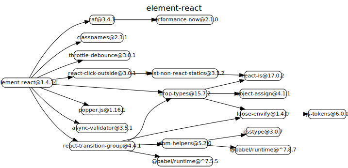
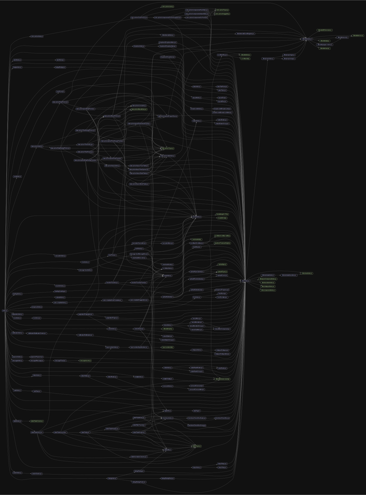

# 源码分析

## 文件结构

``` bash
/Users/liufang/openSource/FunnyLiu/element-react
├── CONTRIBUTING.md
├── LICENSE
├── README.md
├── build
|  ├── npm
|  |  ├── index.js
|  |  └── next.js
|  ├── scripts
|  |  ├── prepare.sh
|  |  └── release.sh
|  └── site
|     ├── index.html
|     └── webpack.config.js
├── flow
|  └── modules.js
├── libs
|  ├── animate
|  |  ├── index.js
|  |  └── transition.jsx
|  ├── collapse
|  |  └── index.jsx
|  ├── component
|  |  └── index.js
|  ├── editor
|  |  ├── index.jsx
|  |  └── style.scss
|  ├── index.js
|  ├── internal
|  |  ├── EventRegister.jsx
|  |  └── index.js
|  ├── markdown
|  |  ├── canvas.jsx
|  |  └── index.jsx
|  ├── props
|  |  ├── index.js
|  |  ├── range.js
|  |  └── regex.js
|  ├── pureComponent
|  |  └── index.js
|  ├── transition
|  |  └── index.js
|  ├── utils
|  |  ├── IDGenerator.js
|  |  ├── assert.js
|  |  ├── date.js
|  |  ├── dom.js
|  |  ├── errors.js
|  |  ├── index.js
|  |  ├── popper-mixins.js
|  |  ├── react.js
|  |  ├── resize-event.js
|  |  └── style.js
|  └── view
|     └── index.js
├── package.json
├── site
|  ├── assets
|  |  ├── favicon.ico
|  |  ├── github.png
|  |  └── logo.svg
|  ├── docs
|  |  ├── en-US
|  |  |  ├── alert.md
|  |  |  ├── badge.md
|  |  |  ├── breadcrumb.md
|  |  |  ├── button.md
|  |  |  ├── card.md
|  |  |  ├── carousel.md
|  |  |  ├── cascader.md
|  |  |  ├── checkbox.md
|  |  |  ├── collapse.md
|  |  |  ├── color-picker.md
|  |  |  ├── color.md
|  |  |  ├── custom-theme.md
|  |  |  ├── date-picker.md
|  |  |  ├── datetime-picker.md
|  |  |  ├── dialog.md
|  |  |  ├── dropdown.md
|  |  |  ├── form.md
|  |  |  ├── i18n.md
|  |  |  ├── icon.md
|  |  |  ├── input-number.md
|  |  |  ├── input.md
|  |  |  ├── layout.md
|  |  |  ├── loading.md
|  |  |  ├── menu.md
|  |  |  ├── message-box.md
|  |  |  ├── message.md
|  |  |  ├── notification.md
|  |  |  ├── pagination.md
|  |  |  ├── popover.md
|  |  |  ├── progress.md
|  |  |  ├── quick-start.md
|  |  |  ├── radio.md
|  |  |  ├── rate.md
|  |  |  ├── select.md
|  |  |  ├── slider.md
|  |  |  ├── steps.md
|  |  |  ├── switch.md
|  |  |  ├── table.md
|  |  |  ├── tabs.md
|  |  |  ├── tag.md
|  |  |  ├── time-picker.md
|  |  |  ├── tooltip.md
|  |  |  ├── transfer.md
|  |  |  ├── tree.md
|  |  |  ├── typography.md
|  |  |  └── upload.md
|  |  └── zh-CN
|  |     ├── alert.md
|  |     ├── badge.md
|  |     ├── breadcrumb.md
|  |     ├── button.md
|  |     ├── card.md
|  |     ├── carousel.md
|  |     ├── cascader.md
|  |     ├── checkbox.md
|  |     ├── collapse.md
|  |     ├── color-picker.md
|  |     ├── color.md
|  |     ├── custom-theme.md
|  |     ├── date-picker.md
|  |     ├── datetime-picker.md
|  |     ├── dialog.md
|  |     ├── dropdown.md
|  |     ├── form.md
|  |     ├── i18n.md
|  |     ├── icon.md
|  |     ├── input-number.md
|  |     ├── input.md
|  |     ├── layout.md
|  |     ├── loading.md
|  |     ├── menu.md
|  |     ├── message-box.md
|  |     ├── message.md
|  |     ├── notification.md
|  |     ├── pagination.md
|  |     ├── popover.md
|  |     ├── progress.md
|  |     ├── quick-start.md
|  |     ├── radio.md
|  |     ├── rate.md
|  |     ├── select.md
|  |     ├── slider.md
|  |     ├── steps.md
|  |     ├── switch.md
|  |     ├── table.md
|  |     ├── tabs.md
|  |     ├── tag.md
|  |     ├── time-picker.md
|  |     ├── tooltip.md
|  |     ├── transfer.md
|  |     ├── tree.md
|  |     ├── typography.md
|  |     └── upload.md
|  ├── index.html
|  ├── index.jsx
|  ├── locales
|  |  ├── en-US.js
|  |  ├── index.js
|  |  └── zh-CN.js
|  ├── page.jsx
|  ├── pages
|  |  ├── alert
|  |  |  ├── index.jsx
|  |  |  └── style.scss
|  |  ├── badge
|  |  |  ├── index.jsx
|  |  |  └── style.scss
|  |  ├── breadcrumb
|  |  |  └── index.jsx
|  |  ├── button
|  |  |  ├── index.jsx
|  |  |  └── style.scss
|  |  ├── card
|  |  |  ├── hamburger.png
|  |  |  ├── index.jsx
|  |  |  └── style.scss
|  |  ├── carousel
|  |  |  ├── index.jsx
|  |  |  └── style.scss
|  |  ├── cascader
|  |  |  ├── index.jsx
|  |  |  └── style.scss
|  |  ├── checkbox
|  |  |  ├── index.jsx
|  |  |  └── style.scss
|  |  ├── collapse
|  |  |  ├── index.jsx
|  |  |  └── style.scss
|  |  ├── color
|  |  |  ├── index.jsx
|  |  |  └── style.scss
|  |  ├── color-picker
|  |  |  ├── index.jsx
|  |  |  └── style.scss
|  |  ├── custom-theme
|  |  |  └── index.jsx
|  |  ├── date-picker
|  |  |  ├── index.jsx
|  |  |  └── style.scss
|  |  ├── datetime-picker
|  |  |  ├── index.jsx
|  |  |  └── style.scss
|  |  ├── dialog
|  |  |  ├── index.jsx
|  |  |  └── style.scss
|  |  ├── dropdown
|  |  |  ├── index.jsx
|  |  |  └── style.scss
|  |  ├── form
|  |  |  ├── index.jsx
|  |  |  └── style.scss
|  |  ├── i18n
|  |  |  ├── index.jsx
|  |  |  └── style.scss
|  |  ├── icon
|  |  |  ├── iconList.js
|  |  |  ├── index.jsx
|  |  |  └── style.scss
|  |  ├── index.jsx
|  |  ├── input
|  |  |  ├── custom-item.jsx
|  |  |  ├── index.jsx
|  |  |  └── style.scss
|  |  ├── input-number
|  |  |  ├── index.jsx
|  |  |  └── style.scss
|  |  ├── installation
|  |  |  └── index.jsx
|  |  ├── layout
|  |  |  ├── index.jsx
|  |  |  └── style.scss
|  |  ├── loading
|  |  |  ├── index.jsx
|  |  |  └── style.scss
|  |  ├── menu
|  |  |  ├── index.jsx
|  |  |  └── style.scss
|  |  ├── message
|  |  |  ├── index.jsx
|  |  |  └── style.scss
|  |  ├── message-box
|  |  |  ├── index.jsx
|  |  |  └── style.scss
|  |  ├── notification
|  |  |  ├── index.jsx
|  |  |  └── style.scss
|  |  ├── pagination
|  |  |  ├── index.jsx
|  |  |  └── style.scss
|  |  ├── popover
|  |  |  ├── index.jsx
|  |  |  └── style.scss
|  |  ├── progress
|  |  |  ├── index.jsx
|  |  |  └── style.scss
|  |  ├── quick-start
|  |  |  └── index.jsx
|  |  ├── radio
|  |  |  ├── index.jsx
|  |  |  └── style.scss
|  |  ├── rate
|  |  |  ├── index.jsx
|  |  |  └── style.scss
|  |  ├── select
|  |  |  ├── index.jsx
|  |  |  └── style.scss
|  |  ├── slider
|  |  |  ├── index.jsx
|  |  |  └── style.scss
|  |  ├── steps
|  |  |  └── index.jsx
|  |  ├── switch
|  |  |  ├── index.jsx
|  |  |  └── style.scss
|  |  ├── table
|  |  |  ├── index.jsx
|  |  |  └── style.scss
|  |  ├── tabs
|  |  |  └── index.jsx
|  |  ├── tag
|  |  |  ├── index.jsx
|  |  |  └── style.scss
|  |  ├── time-picker
|  |  |  ├── index.jsx
|  |  |  └── style.scss
|  |  ├── tooltip
|  |  |  ├── index.jsx
|  |  |  └── style.scss
|  |  ├── transfer
|  |  |  └── index.jsx
|  |  ├── tree
|  |  |  ├── index.jsx
|  |  |  └── style.scss
|  |  ├── typography
|  |  |  ├── index.jsx
|  |  |  └── style.scss
|  |  └── upload
|  |     ├── index.jsx
|  |     └── style.scss
|  ├── run.js
|  └── styles
|     ├── base.scss
|     └── prism.css
├── src
|  ├── alert
|  |  ├── Alert.jsx
|  |  ├── __test__
|  |  |  └── Alert_test.jsx
|  |  └── index.js
|  ├── auto-complete
|  |  ├── AutoComplete.jsx
|  |  ├── Suggestions.jsx
|  |  └── index.js
|  ├── badge
|  |  ├── Badge.jsx
|  |  ├── __test__
|  |  |  └── Badge_test.jsx
|  |  └── index.js
|  ├── breadcrumb
|  |  ├── Breadcrumb.jsx
|  |  ├── BreadcrumbItem.jsx
|  |  ├── __test__
|  |  |  └── Breadcrumb_test.jsx
|  |  └── index.js
|  ├── button
|  |  ├── Button.jsx
|  |  ├── ButtonGroup.jsx
|  |  ├── __test__
|  |  |  └── Button_test.jsx
|  |  └── index.js
|  ├── card
|  |  ├── Card.jsx
|  |  ├── __test__
|  |  |  └── Card_test.jsx
|  |  └── index.js
|  ├── carousel
|  |  ├── Carousel.jsx
|  |  ├── CarouselItem.jsx
|  |  └── index.js
|  ├── cascader
|  |  ├── Cascader.jsx
|  |  ├── Menu.jsx
|  |  ├── __test__
|  |  |  └── Cascader_test.jsx
|  |  └── index.js
|  ├── checkbox
|  |  ├── CheckBox.jsx
|  |  ├── CheckBoxButton.jsx
|  |  ├── CheckBoxGroup.jsx
|  |  ├── __test__
|  |  |  └── Checkbox_test.jsx
|  |  └── index.js
|  ├── collapse
|  |  ├── Collapse.jsx
|  |  ├── CollapseItem.jsx
|  |  └── index.js
|  ├── color-picker
|  |  ├── ColorPicker.jsx
|  |  ├── Types.js
|  |  ├── color.js
|  |  ├── components
|  |  |  ├── AlphaSlider.jsx
|  |  |  ├── HueSlider.jsx
|  |  |  ├── PickerDropdown.jsx
|  |  |  └── SvPanel.jsx
|  |  ├── draggable.js
|  |  └── index.js
|  ├── date-picker
|  |  ├── BasePicker.jsx
|  |  ├── DatePicker.jsx
|  |  ├── DateRangePicker.jsx
|  |  ├── MountBody.jsx
|  |  ├── TimePicker.jsx
|  |  ├── TimeRangePicker.jsx
|  |  ├── TimeSelect.jsx
|  |  ├── Types.js
|  |  ├── __test__
|  |  |  ├── DatePicker_test.jsx
|  |  |  ├── TimeSelect_test.jsx
|  |  |  └── utils.js
|  |  ├── basic
|  |  |  ├── DateTable.jsx
|  |  |  ├── MonthTable.jsx
|  |  |  ├── TimeSpinner.jsx
|  |  |  ├── YearTable.jsx
|  |  |  └── index.js
|  |  ├── constants.js
|  |  ├── index.js
|  |  ├── panel
|  |  |  ├── DatePanel.jsx
|  |  |  ├── DateRangePanel.jsx
|  |  |  ├── PopperBase.js
|  |  |  ├── TimePanel.jsx
|  |  |  ├── TimeRangePanel.jsx
|  |  |  └── TimeSelectPanel.jsx
|  |  └── utils
|  |     └── index.js
|  ├── dialog
|  |  ├── Dialog.jsx
|  |  ├── DialogBody.jsx
|  |  ├── DialogFooter.jsx
|  |  └── index.js
|  ├── dropdown
|  |  ├── Dropdown.jsx
|  |  ├── DropdownItem.jsx
|  |  ├── DropdownMenu.jsx
|  |  └── index.js
|  ├── form
|  |  ├── Form.jsx
|  |  ├── FormItem.jsx
|  |  └── index.js
|  ├── icon
|  |  ├── Icon.jsx
|  |  └── index.js
|  ├── index.js
|  ├── input
|  |  ├── Input.jsx
|  |  ├── __test__
|  |  |  └── Input_test.jsx
|  |  ├── calcTextareaHeight.js
|  |  └── index.js
|  ├── input-number
|  |  ├── InputNumber.jsx
|  |  ├── index.js
|  |  └── util.js
|  ├── layout
|  |  ├── Col.jsx
|  |  ├── Row.jsx
|  |  ├── __test__
|  |  |  └── Layout_test.jsx
|  |  └── index.js
|  ├── loading
|  |  ├── Loading.jsx
|  |  └── index.js
|  ├── locale
|  |  ├── format.js
|  |  ├── index.js
|  |  └── lang
|  |     ├── bg.js
|  |     ├── ca.js
|  |     ├── cz.js
|  |     ├── da.js
|  |     ├── de.js
|  |     ├── el.js
|  |     ├── en.js
|  |     ├── es.js
|  |     ├── fa.js
|  |     ├── fi.js
|  |     ├── fr.js
|  |     ├── id.js
|  |     ├── it.js
|  |     ├── ja.js
|  |     ├── ko.js
|  |     ├── nb-NO.js
|  |     ├── nl.js
|  |     ├── pl.js
|  |     ├── pt-br.js
|  |     ├── pt.js
|  |     ├── ru-RU.js
|  |     ├── sk.js
|  |     ├── sv-SE.js
|  |     ├── th.js
|  |     ├── tk.js
|  |     ├── tr-TR.js
|  |     ├── ua.js
|  |     ├── vi.js
|  |     ├── zh-CN.js
|  |     └── zh-TW.js
|  ├── menu
|  |  ├── Menu.jsx
|  |  ├── MenuItem.jsx
|  |  ├── MenuItemGroup.jsx
|  |  ├── MixinComponent.jsx
|  |  ├── SubMenu.jsx
|  |  └── index.js
|  ├── message
|  |  ├── Message.jsx
|  |  ├── Toast.jsx
|  |  ├── assets.js
|  |  └── index.js
|  ├── message-box
|  |  ├── MessageBox.jsx
|  |  └── index.js
|  ├── notification
|  |  ├── Notification.jsx
|  |  ├── NotificationCenter.jsx
|  |  └── index.js
|  ├── pagination
|  |  ├── Pager.jsx
|  |  ├── Pagination.jsx
|  |  └── index.js
|  ├── popover
|  |  ├── Popover.jsx
|  |  └── index.js
|  ├── progress
|  |  ├── Progress.jsx
|  |  └── index.js
|  ├── radio
|  |  ├── Radio.jsx
|  |  ├── RadioButton.jsx
|  |  ├── RadioGroup.jsx
|  |  └── index.js
|  ├── rate
|  |  ├── Rate.jsx
|  |  ├── __test__
|  |  |  └── rate_test.jsx
|  |  └── index.js
|  ├── scrollbar
|  |  ├── Bar.jsx
|  |  ├── Scrollbar.jsx
|  |  ├── index.js
|  |  ├── scrollbar-width.js
|  |  └── util.js
|  ├── select
|  |  ├── Option.jsx
|  |  ├── OptionGroup.jsx
|  |  ├── Select.jsx
|  |  └── index.js
|  ├── slider
|  |  ├── Button.jsx
|  |  ├── Slider.jsx
|  |  └── index.js
|  ├── steps
|  |  ├── Step.jsx
|  |  ├── Steps.jsx
|  |  └── index.js
|  ├── switch
|  |  ├── Switch.jsx
|  |  ├── __test__
|  |  |  └── switch_test.jsx
|  |  └── index.js
|  ├── table
|  |  ├── FilterPannel.jsx
|  |  ├── Table.jsx
|  |  ├── TableBody.jsx
|  |  ├── TableColumn.js
|  |  ├── TableFooter.jsx
|  |  ├── TableHeader.jsx
|  |  ├── TableLayout.jsx
|  |  ├── TableStore.jsx
|  |  ├── Types.js
|  |  ├── index.js
|  |  ├── normalizeColumns.jsx
|  |  └── utils.js
|  ├── tabs
|  |  ├── TabPane.jsx
|  |  ├── Tabs.jsx
|  |  ├── __test__
|  |  |  └── tabs_test.jsx
|  |  └── index.js
|  ├── tag
|  |  ├── Tag.jsx
|  |  ├── __test__
|  |  |  └── Tag_test.jsx
|  |  └── index.js
|  ├── tooltip
|  |  ├── Tooltip.jsx
|  |  ├── __test__
|  |  |  └── tooltip_test.jsx
|  |  └── index.js
|  ├── transfer
|  |  ├── Transfer.jsx
|  |  ├── TransferPanel.jsx
|  |  └── index.js
|  ├── tree
|  |  ├── Node.jsx
|  |  ├── Tree.jsx
|  |  ├── index.js
|  |  └── model
|  |     ├── node.js
|  |     ├── tree-store.js
|  |     └── util.js
|  └── upload
|     ├── AjaxUpload.jsx
|     ├── Cover.jsx
|     ├── Types.js
|     ├── Upload.jsx
|     ├── UploadList.jsx
|     ├── ajax.js
|     ├── iFrameUpload.jsx
|     └── index.js
├── tests
|  └── jest
|     ├── components
|     |  ├── __snapshots__
|     |  |  └── tooltip.js.snap
|     |  └── tooltip.js
|     ├── config.js
|     ├── mock.js
|     └── polyfill.js
└── typings
   ├── index.d.ts
   └── typing-tests
      ├── Alert.tsx
      ├── AutoComplete.tsx
      ├── Badge.tsx
      ├── Breadcrumb.tsx
      ├── Button.tsx
      ├── Card.tsx
      ├── Carousel.tsx
      ├── Cascader.tsx
      ├── Checkbox.tsx
      ├── Collapse.tsx
      ├── ColorPicker.tsx
      ├── Datepicker.tsx
      ├── Dialog.tsx
      ├── Dropdown.tsx
      ├── Form.tsx
      ├── Icon.tsx
      ├── Input.tsx
      ├── InputNumber.tsx
      ├── Layout.tsx
      ├── Loading.tsx
      ├── Menu.tsx
      ├── Message.ts
      ├── MessageBox.ts
      ├── Notification.tsx
      ├── Pagination.tsx
      ├── Popover.tsx
      ├── Progress.tsx
      ├── Radio.tsx
      ├── Rate.tsx
      ├── Select.tsx
      ├── Slider.tsx
      ├── Steps.tsx
      ├── Switch.tsx
      ├── Table.tsx
      ├── Tabs.tsx
      ├── Tag.tsx
      ├── Timepicker.tsx
      ├── Tooltip.tsx
      ├── Transfer.tsx
      ├── Tree.tsx
      ├── Upload.tsx
      ├── i18n.ts
      └── tsconfig.json

directory: 142 file: 496

ignored

```

## 外部模块依赖



## 内部模块依赖


  